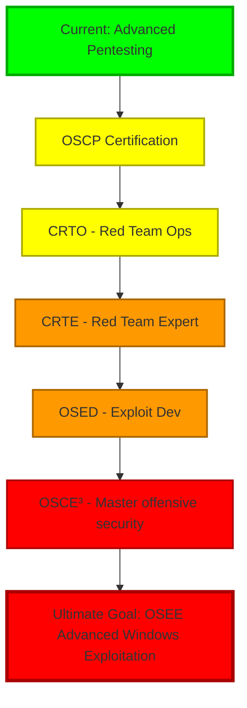

<div align="center">

<!-- Animated Header -->


<!-- Dynamic Typing Animation -->
<p align="center">
  
</p>

<!-- Animated GIF Banner -->


<!-- Social Badges with Custom Styling -->
<p align="center">
  <a href="https://linkedin.com/in/kasemshibli">
    
  </a>
  <a href="mailto:kasem545@proton.me">
    
  </a>
  <a href="https://kasem545.github.io/">
    
  </a>
  <a href="https://app.hackthebox.com/profile/671151">
    
  </a>
  <a href="https://tryhackme.com/p/kasemsh">
    
  </a>
</p>

<!-- Profile Stats -->
<p align="center">
  
  
  
</p>

</div>

---

<!-- Animated Divider -->


##  About Me

```python
#!/usr/bin/env python3
# -*- coding: utf-8 -*-

class OffensiveSecuritySpecialist:
    """
    Elite cybersecurity professional specializing in offensive operations
    """
    
    def __init__(self):
        self.username = "Kasem Shibli"
        self.role = "Red Team Operator & Penetration Tester"
        self.location = "IL Israel"
        self.language_spoken = ["ar_IL", "en_US", "he_IL"]
        
        self.code = {
            "Intermediate": ["Python", "PowerShell", "Bash", "C/C++"],
            "learning": ["Windows APIs", "lua", "Rust"]
        }
        
        self.tools = {
            "exploitation": ["Metasploit", "Cobalt Strike", "Empire", "Adaptixc2"],
            "web_testing": ["Burp Suite Pro", "OWASP ZAP", "SQLMap", "Nuclei"],
            "network": ["Nmap", "Masscan", "Wireshark", "Responder", "NetExec"],
            "ad_attack": ["BloodHound", "Mimikatz", "Rubeus", "PowerView", "Impacket"],
            "osint": ["TheHarvester", "Recon-ng", "Maltego", "Shodan", "Amass"],
            "custom": ["Self-developed tools available on GitHub"]
        }
        
        self.methodologies = [
            "MITRE ATT&CK Framework",
            "OWASP Testing Guide", 
            "PTES (Penetration Testing Execution Standard)",
            "OSSTMM (Open Source Security Testing Methodology)",
            "NIST Cybersecurity Framework"
        ]
    
    def daily_routine(self):
        activities = {
            "morning": "☕ HTB/THM challenges + CTF writeups",
            "afternoon": "💻 Tool development & exploit research", 
            "evening": "📖 Reading research papers & studying for certs",
            "night": "🎮 Gaming & more hacking"
        }
        return activities
    
    def get_quote(self):
        return "In God we trust, everything else we hack! 🔓"
    
    def contact_me(self):
        return {
            "email": "kasem545@proton.me",
            "linkedin": "linkedin.com/in/kasemshibli",
            "website": "kasem545.github.io",
            "pgp": """-----BEGIN PGP PUBLIC KEY BLOCK-----

mDMEaRxGxBYJKwYBBAHaRw8BAQdAXe8/z8qK+vVk86o5hYkVsaKPz2pUPfF/NAgd
BFVJ/Ku0IUthc2VtIFNoaWJsaSA8a2FzZW01NDVAcHJvdG9uLm1lPoiZBBMWCgBB
FiEECWmzNjnkwbRWdZVFDdi+ge8vG94FAmkcRsQCGwMFCQWk6NwFCwkIBwICIgIG
FQoJCAsCBBYCAwECHgcCF4AACgkQDdi+ge8vG960vgEAjT3LPbYTmPYNqw84+UnX
xOS4V6vqXj4m6FXGz70u2MoA/3UOlnFoTsElVCTGPuCKw174DOJFkjMeE+9a17Kq
v54OuDgEaRxGxBIKKwYBBAGXVQEFAQEHQCik4QIh8Tkq+7w4mV8lHzG6GYkD/MA2
7BOxvuthjoNkAwEIB4h+BBgWCgAmFiEECWmzNjnkwbRWdZVFDdi+ge8vG94FAmkc
RsQCGwwFCQWk6NwACgkQDdi+ge8vG94btgD/fzQW0zpk1P8u/xYtBj4c+LKd8gLs
yuINjhpMGLjwxfQBANhQRW+d0gr/0OkAccOe+J1DKz6WVKxcWJHyM7kJ0u0E
=AKMh
-----END PGP PUBLIC KEY BLOCK-----"""
        }

# Initialize
hacker = OffensiveSecuritySpecialist()
print(f"[+] {hacker.username}: {hacker.get_quote()}")
print(f"[+] Current Focus: {hacker.current_projects()}")
```


---

## 🎯  Current Mission Objectives

<table>
  <tr>
    <td width="50%" valign="top">
      
### 🔥 Active Operations
      
```yaml
pentesting:
  - Active Directory exploitation
  - Web application security assessments  
  - Network penetration testing
  - Mobile application testing
  - Cloud security assessments (AWS/Azure)

research:
  - Windows kernel exploitation
  - EDR/AV evasion techniques
  - Zero-day vulnerability research
  - Malware development & analysis
  - Reverse engineering binaries

automation:
  - Custom reconnaissance tools
  - Automated exploitation frameworks
  - CI/CD security pipeline integration
  - Red team infrastructure automation
```

   </td>
    <td width="50%" valign="top">

### 🎓 Learning Path 2026/2027



   </td>
  </tr>
</table>


---

## 📊  GitHub Analytics

<div align="center">

<!-- GitHub Stats Cards -->
<a href="https://github.com/kasem545">
  
</a>
<a href="https://github.com/kasem545">
  
</a>

<!-- GitHub Streak Stats -->
<a href="https://github.com/kasem545">
  
</a>

<!-- Activity Graph -->
<a href="https://github.com/kasem545">
  
</a>

<!-- Detailed Stats -->
<details>
<summary><b>📈 More Detailed Stats</b></summary>
<br>
<p align="center">
  
  
  
  
  
</p>
</details>

</div>


---

## 🏆  Achievements & Trophies

<div align="center">
  
<!-- GitHub Trophies -->


</div>


---

## 🎖️  Professional Certifications

<div align="center">

### 🏅 Certified & Proven

<table>
  <tr>
    <td align="center" width="140">
      <a href="https://www.credly.com/badges/9223a40b-666d-4658-b6ac-024d0cf07f17">
        
        <br><b>PCEP</b>
        <br><sub>Certified Entry-Level Python Programmer</sub>
      </a>
    </td>
    <td align="center" width="140">
      <a href="https://certs.ine.com/8cb6c0e4-8fd0-408d-a379-90842775a19a">
        
        <br><b>eWPT</b>
        <br><sub>Web Application Penetration Tester</sub>
      </a>
    </td>
    <td align="center" width="140">
      <a href="https://certs.ine.com/ac8f16e5-7f5f-4cf1-a46c-deb8011407ae">
        
        <br><b>eCPPT</b>
        <br><sub>Certified Professional Penetration Tester</sub>
      </a>
    </td>
    <td align="center" width="140">
      <a href="https://certs.ine.com/cbd1fdd4-ff29-48a6-bbb3-9c1ab782c935">
        
        <br><b>eJPT</b>
        <br><sub>Junior Penetration Tester</sub>
      </a>
    </td>
    <td align="center" width="140">
      <a href="https://certified.tcm-sec.com/6663bab5-984f-4c99-85fb-6b9c9dca5ee6">
        
        <br><b>PNPT</b>
        <br><sub>Practical Network Penetration Tester</sub>
      </a>
    </td>
  </tr>
  <tr>
    <td align="center" width="140">
      <a href="https://www.credential.net/6f3bdc4c-c3c7-4583-9f94-c6adcd55e339">
        
        <br><b>Attacking and Defending Active Directory</b>
      </a>
    </td>
    <td align="center" width="140">
      <a href="https://www.credly.com/badges/ffcfa8b2-e680-43dc-b73e-3703b8ce64ec">
        
        <br><b>Jr Penetration Tester (PT1)</b>
        <br><sub>Jr Penetration Tester</sub>
      </a>
    </td>
    <td align="center" width="140">
      <a href="https://labs.cyberwarfare.live/credential/achievement/68e5dad2d3976ffc330d73f3">
        
        <br><b>MCRTA</b>
        <br><sub>Certified Multi-Cloud Red Team Analyst </sub>
      </a>
    </td>
    <td align="center" width="140">
      <a href="https://labs.cyberwarfare.live/credential/achievement/68f11583bb69a1b15bc2406e">
        
        <br><b>CRTA</b>
        <br><sub>Certified Red Team Analyst</sub>
      </a>
    </td>
    <td align="center" width="140">
      <a href="#">
        
        <br><b>CRTP</b>
        <br><sub>Certified Red Team Professional </sub>
      </a>
    </td>
  </tr>
</table>

---

### 🎯 Currently Pursuing

<p align="center">
  
  
  
  
</p>

</div>


---

## 🎮  Capture The Flag Excellence

<div align="center">

<!-- HTB & THM Badges -->
<table>
  <tr>
    <td align="center" width="50%">
      <a href="https://app.hackthebox.com/profile/671151">
        
      </a>
      <br><br>
      
      
    </td>
    <td align="center" width="50%">
      <a href="https://tryhackme.com/p/kasemsh">
        
      </a>
      <br><br>
      
      
    </td>
  </tr>
</table>

---

### 📈 CTF Statistics & Achievements

```
┌─────────────────────────────────────────────────────────────────┐
│  Platform       │  Machines  │  Rank      │  Points  │  Streak  │
├─────────────────────────────────────────────────────────────────┤
│  HackTheBox     │    50+     │   Active   │  1500+   │   30d    │
│  TryHackMe      │   100+     │   Top 5%   │  5000+   │   45d    │
└─────────────────────────────────────────────────────────────────┘

Recent Achievements:
  ✅ Completed Pro Labs: DANTE, P.O.O, FullHouse, Solar
  ✅ HackTheBox Seasonal: All challenges completed
  ✅ TryHackMe: Offensive Pentesting Path 100%
```

</div>


---

## 💻  Tech Arsenal & Skills

<div align="center">

### 🔧 Programming & Scripting Languages

<table>
  <tr>
    <td align="center" width="110">
      
      <br><b>Python</b>
    </td>
    <td align="center" width="110">
      
      <br><b>Bash</b>
    </td>
    <td align="center" width="110">
      
      <br><b>PowerShell</b>
    </td>
    <td align="center" width="110">
      
      <br><b>C/C++</b>
    </td>
    <td align="center" width="110">
      
      <br><b>JavaScript</b>
    </td>
    <td align="center" width="110">
      
      <br><b>PHP</b>
    </td>
  </tr>
</table>

### 🌐 Web & Database Technologies

<table>
  <tr>
    <td align="center" width="110">
      
      <br><b>HTML5</b>
    </td>
    <td align="center" width="110">
      
      <br><b>CSS3</b>
    </td>
    <td align="center" width="110">
      
      <br><b>MySQL</b>
    </td>
    <td align="center" width="110">
      
      <br><b>PostgreSQL</b>
    </td>
    <td align="center" width="110">
      
      <br><b>MongoDB</b>
    </td>
    <td align="center" width="110">
      
      <br><b>Redis</b>
    </td>
    <td align="center" width="110">
      
      <br><b>SQLite</b>
    </td>
  </tr>
</table>

### 🛠️ DevOps & Infrastructure

<table>
  <tr>
    <td align="center" width="110">
      
      <br><b>Linux</b>
    </td>
    <td align="center" width="110">
      
      <br><b>Docker</b>
    </td>
    <td align="center" width="110">
      
      <br><b>Kubernetes</b>
    </td>
    <td align="center" width="110">
      
      <br><b>Git</b>
    </td>
    <td align="center" width="110">
      
      <br><b>GitHub</b>
    </td>
    <td align="center" width="110">
      
      <br><b>AWS</b>
    </td>
    <td align="center" width="110">
      
      <br><b>Azure</b>
    </td>
  </tr>
</table>

### 🎨 Development Tools & IDEs

<table>
  <tr>
    <td align="center" width="110">
      
      <br><b>VS Code</b>
    </td>
    <td align="center" width="110">
      
      <br><b>Vim</b>
    </td>
    <td align="center" width="110">
      
      <br><b>Neovim</b>
    </td>
    <td align="center" width="110">
      
      <br><b>VS 2022</b>
    </td>
    <td align="center" width="110">
      
      <br><b>PyCharm</b>
    </td>
    <td align="center" width="110">
      
      <br><b>Sublime</b>
    </td>
    <td align="center" width="110">
      
      <br><b>Regex</b>
    </td>
  </tr>
</table>

</div>


---

## 🎯  Expertise Breakdown

<div align="center">

<table>
  <tr>
    <td width="25%" align="center">
      
      <h3>🔴 Red Teaming</h3>
      <p align="center">
        ✅ Active Directory exploitation<br>
        ✅ Lateral movement techniques<br>
        ✅ Persistence mechanisms<br>
        ✅ Privilege escalation<br>
        ✅ Domain enumeration<br>
        ✅ Kerberos attacks<br>
        ✅ C2 infrastructure setup
      </p>
    </td>
    <td width="25%" align="center">
      
      <h3>🌐 Web Security</h3>
      <p align="center">
        ✅ OWASP Top 10<br>
        ✅ SQL Injection<br>
        ✅ XSS & CSRF<br>
        ✅ Authentication bypass<br>
        ✅ API security testing<br>
        ✅ Web app fuzzing<br>
        ✅ Business logic flaws
      </p>
    </td>
    <td width="25%" align="center">
      
      <h3>🔬 Malware Analysis</h3>
      <p align="center">
        ✅ Static analysis<br>
        ✅ Dynamic analysis<br>
        ✅ Behavioral analysis<br>
        ✅ Reverse engineering<br>
        ✅ Evasion techniques<br>
        ✅ Obfuscation methods<br>
        ✅ Threat intelligence
      </p>
    </td>
  </tr>
</table>

### 📊 Skill Proficiency Levels

```text
Python          ███████████████░░░░░   75%  Intermediate
Bash            ███████████████░░░░░   75%  Intermediate
PowerShell      ███████████████░░░░░   75%  Intermediate
C/C++           ███████████████░░░░░   75%  Intermediate
Web Pentesting  ██████████████████░░   90%  Advanced
Network Pentest ██████████████████░░   90%  Advanced
AD Exploitation ██████████████████░░   90%  Advanced
Exploit Dev     ████████████░░░░░░░░   60%  Intermediate
Malware Dev     ██████░░░░░░░░░░░░░░   30%  Beginner
OSINT           ███████████████░░░░░   75%  Intermediate
Social Eng      ██████████████████░░   90%  Advanced
```

</div>


---

## 🔥  Featured Projects & Tools

<div align="center">

<!-- Pinned Repos would go here - these are examples -->
<a href="https://github.com/kasem545">
  
</a>

</div>

### 🛠️ Custom Security Tools

<details>
<summary><b>🔍 Click to expand my custom tools arsenal</b></summary>
<br>

| Tool Name | Description | Language | Status |
|-----------|-------------|----------|--------|
| **SubEnum** | Advanced subdomain enumeration using CT logs | Bash | ✅ Active |
| **RevShell-Gen** | Multi-language reverse shell payload generator | Bash | ✅ Active |
| **CTF-Manager** | Automated CTF directory setup with statistics | Bash | ✅ Active |
| **AD-Hunter** | Active Directory enumeration & exploitation | PowerShell | 🚧 Development |
| **Evasion-Kit** | EDR/AV bypass techniques collection | Python/C++ | 🚧 Development |
| **WebFuzzer-Pro** | Advanced web application fuzzing tool | Python | 📋 Planned |
| **C2-Framework** | Custom command & control framework | Go | 📋 Planned |
| **Exploit-DB** | Personal exploit development database | Multiple | 🚧 Development |

</details>


---

## 📝  Latest Blog Posts & Writeups

<div align="center">

<table>
  <tr>
    <td width="50%">
      
### 📰 Recent Articles

<!-- BLOG-POST-LIST:START -->
- 📰 [Kerberos Attacks cheatsheet](https://kasem545.github.io/blog/posts/kerberos/)
- 📰 [Windows Local Privilege Escalation](https://kasem545.github.io/blog/posts/windows-privesc/)
- 📰 [Ligolo-MP/Ligolo-NG Cheatsheet](https://kasem545.github.io/blog/posts/ligolo-mp/)
- 📰 [AD ACLs Cheatsheet](https://kasem545.github.io/blog/posts/ligolo-mp/)
- 📰 [Certipy Cheatsheet](https://kasem545.github.io/blog/posts/certifpy/)
<!-- BLOG-POST-LIST:END -->

   </td>
    <td width="50%">

### 🎮 CTF Writeups

<!-- CTF-WRITEUP-LIST:START -->
- 📝 [TryHackMe: Sequence](https://kasem545.github.io/blog/posts/tryhackme-sequence/)
- 📝 [TryHackMe: Voyage](https://kasem545.github.io/blog/posts/tryhackme-voyage/)
- 📝 [TryHackMe: Extract](https://kasem545.github.io/blog/posts/tryhackme-extract/)
- 📝 [TryHackMe: Contrabando](https://kasem545.github.io/blog/posts/tryhackme-contrabando/)
- 📝 [TryHackMe: Soupedecode 01](https://kasem545.github.io/blog/posts/tryhackme-soupedecode_01/)
<!-- CTF-WRITEUP-LIST:END -->

   </td>
  </tr>
</table>

<a href="https://kasem545.github.io">
  
</a>

</div>


<p align="left"> <a href="https://github.com/ryo-ma/github-profile-trophy"></a> </p>

<!--width="220" height="50"-->


### 🔭 Current Focus
- Building and automating internal red-team tools
- Studying advanced Active Directory and privilege escalation techniques
- Experimenting with malware development and detection evasion in lab environments

### 🧠 What I Enjoy
- CTFs & exploit development
- Network and System Hacking
- Reverse engineering and low-level Windows internals
- Writing clean and stealthy offensive scripts in Python & PowerShell


### 🎓 Certifications & Platforms
[](https://app.hackthebox.com/profile/671151)
[](https://tryhackme.com/p/kasemsh)


<a href="https://www.credly.com/badges/9223a40b-666d-4658-b6ac-024d0cf07f17" target="_blank"></a>
<a href="#" target="_blank"></a>
<a href="https://www.credential.net/6f3bdc4c-c3c7-4583-9f94-c6adcd55e339" target="_blank"></a>
<a href="https://certs.ine.com/8cb6c0e4-8fd0-408d-a379-90842775a19a" target="_blank"></a>
<a href="https://certs.ine.com/ac8f16e5-7f5f-4cf1-a46c-deb8011407ae" target="_blank"></a>
<a href="https://certs.ine.com/cbd1fdd4-ff29-48a6-bbb3-9c1ab782c935" target="_blank"></a>
<a href="https://certified.tcm-sec.com/6663bab5-984f-4c99-85fb-6b9c9dca5ee6" target="_blank"></a>
<a href="https://www.credly.com/badges/ffcfa8b2-e680-43dc-b73e-3703b8ce64ec" target="_blank"></a>
<a href="https://labs.cyberwarfare.live/credential/achievement/68e5dad2d3976ffc330d73f3" target="_blank"></a>
<a href="https://labs.cyberwarfare.live/credential/achievement/68f11583bb69a1b15bc2406e" target="_blank"></a>


---


## 🐍 Contribution Snake

<div align="center">
  


</div>


---

## 💰  Support My Research & Development

<div align="center">

If you find my tools, or writeups valuable, consider supporting my work! Your support helps me dedicate more time to developing open-source security tools and creating educational content.

### ☕ Buy Me a Coffee

<a href="https://www.buymeacoffee.com/kasemshibl0">
  
</a>

### 💎 Cryptocurrency Support

<table>
  <tr>
    <td align="center">
      <br>
      <b>Bitcoin (BTC)</b><br>
      <code>Coming Soon</code>
    </td>
    <td align="center">
      <br>
      <b>Ethereum (ETH)</b><br>
      <code>Coming Soon</code>
    </td>
    <td align="center">
      <br>
      <b>Monero (XMR)</b><br>
      <code>Coming Soon</code>
    </td>
  </tr>
</table>

### 🎁 Other Ways to Support


---

**Every contribution, no matter how small, helps me continue my mission of making cybersecurity knowledge accessible to everyone! 🙏**

</div>


---

## 📬  Let's Connect & Collaborate!

<div align="center">

I'm always excited to connect with fellow security researchers, pentesters, and hackers! Whether you want to collaborate on projects, discuss security topics, or just chat about the latest vulnerabilities, feel free to reach out!

### 🌐 Find Me On

<p align="center">
  <a href="mailto:kasem545@proton.me">
    
  </a>
  <a href="https://linkedin.com/in/kasemshibli">
    
  </a>
  <a href="https://kasem545.github.io/">
    
  </a>
</p>

### 🎮 Gaming & CTF Platforms

<p align="center">
  <a href="https://app.hackthebox.com/profile/671151">
    
  </a>
  <a href="https://tryhackme.com/p/kasemsh">
    
  </a>
</p>

### 💬 Let's Talk About

- 🔴 Red Team Operations & Tactics
- 🎯 Penetration Testing Methodologies  
- 💉 Exploit Development & Research
- 🔐 Active Directory Security
- 🌐 Web Application Security
- 🔬 Malware Analysis & Development
- 🎮 CTF Challenges & Writeups
- 📚 Cybersecurity Education & Mentoring
- 🛠️ Tool Development & Automation
- 🤝 Open Source Contributions

</div>


---

## 📜  Hacker's Creed

<div align="center">

```
┌──────────────────────────────────────────────────────────────┐
│                                                              │
│  "We are the ones who knock... on port 443."               │
│                                                              │
│  "The quieter you become, the more you are able to hack."  │
│                                                              │
│  "In God we trust, all others we hack."                     │
│                                                              │
│  "There is no patch for human stupidity."                   │
│                                                              │
│  "The only system that is truly secure is one that is       │
│   powered off, cast in a block of concrete, sealed in a     │
│   lead-lined room with armed guards."                       │
│                                        - Gene Spafford       │
│                                                              │
└──────────────────────────────────────────────────────────────┘
```

---

### 🎯 My Mission

> To contribute to the cybersecurity community by developing innovative tools, sharing knowledge through detailed writeups, and helping others learn offensive security techniques in a responsible and ethical manner.

---

### ⚖️ Responsible Disclosure

I follow responsible disclosure practices for all security research. If you believe I've found a vulnerability in your system, I'm happy to work with you to remediate it before any public disclosure.

</div>


---

<div align="center">

<!-- Random Dev Quote -->


---

<!-- Animated Footer -->


<!-- Matrix Rain Effect ASCII -->
```
    ██░ ██ ▄▄▄      ██▓███ ██▓███ ▓██  ██▓    ██░ ██ ▄▄▄      ▄████▄  ██ ▄█▀██▓███▄    █   ▄████ 
   ▓██░ ██▒████▄   ▓██░  ██▓██░  ██▒██  ██▒   ▓██░ ██▒████▄   ▒██▀ ▀█  ██▄█▒▓██▒██ ▀█   █  ██▒ ▀█▒
   ▒██▀▀██▒██  ▀█▄ ▓██░ ██▓▓██░ ██▓ ▒██ ██░   ▒██▀▀██▒██  ▀█▄ ▒▓█    ▄▓███▄░▒██▓██  ▀█ ██▒▒██░▄▄▄░
   ░▓█ ░██░██▄▄▄▄██▒██▄█▓▒ ▒██▄█▓▒ ░ ▐██▓░   ░▓█ ░██░██▄▄▄▄██▒▓▓▄ ▄██▓██ █▄░██▓██▒  ▐▌██▒░▓█  ██▓
   ░▓█▒░██▓▓█   ▓██▒██▒ ░  ▒██▒ ░  ░ ██▒▓░   ░▓█▒░██▓▓█   ▓██▒ ▓███▀ ▒██▒ █░██▒██░   ▓██░░▒▓███▀▒
    ▒ ░░▒░▒▒▒   ▓▒█▒▓▒░ ░  ▒▓▒░ ░  ██▒▒▒     ▒ ░░▒░▒▒▒   ▓▒█░ ░▒   ▒ ▒ ▒▒ ▓▒▒ ░ ▒░   ▒ ▒  ░▒   ▒ 
    ▒ ░▒░ ░ ▒   ▒▒ ░▒ ░    ░▒ ░   ▓██ ░▒░     ▒ ░▒░ ░ ▒   ▒▒ ░  ░   ░ ░ ░▒ ▒░░ ░ ░    ░     ░   ░ 
    ░  ░░ ░ ░   ▒  ░░      ░░     ▒ ▒ ░░      ░  ░░ ░ ░   ▒   ░ ░   ░ ░ ░░ ░   ░   ░ ░   ░ ░   ░ 
    ░  ░  ░     ░  ░                ░ ░         ░  ░  ░     ░  ░      ░ ░  ░           ░         ░ 
                                  ░ ░                                                              
```

---

<p align="center">
  
  
  
</p>

**🔐 Hack the Planet | Stay Curious | Break Things (Ethically) | Build Better Security 🔐**

<sub>Last Updated: December 2025 | This profile is a living document and continuously evolving</sub>

---

<p align="center">
  <i>⭐ If you find my work interesting, consider starring my repositories! ⭐</i>
  <br>
  <i>🔥 Let's connect and make the cyber world more secure together! 🔥</i>
</p>

</div>
